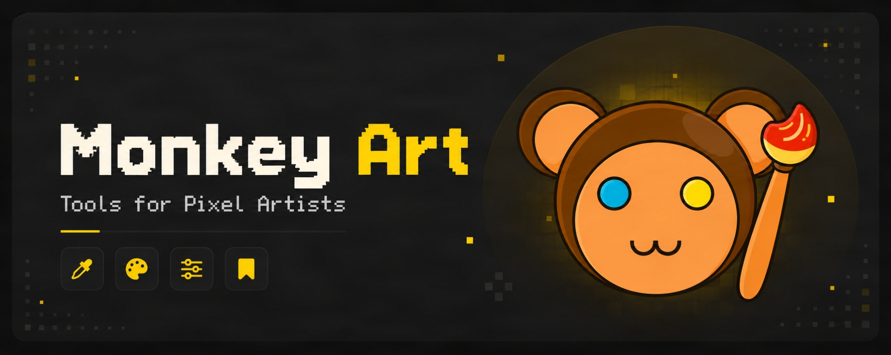
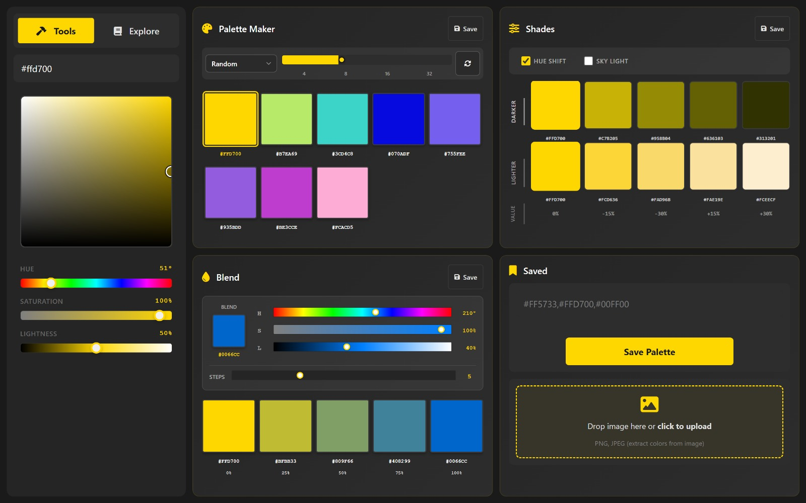
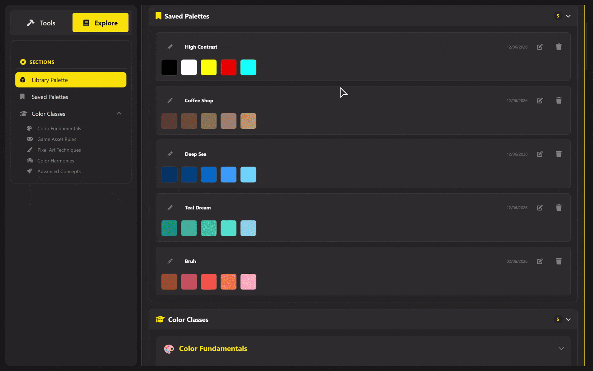

Monkey Art is a web-based toolkit designed to simplify and accelerate the pixel art creation process, whether you're an experienced artist or a game developer looking to level up your visual assets.

> **Simplify your color workflow.** Monkey Art bridges the gap between technical color theory and practical pixel art creation, helping you generate visually cohesive palettes and apply them effectively.

## ✨ What is Monkey Art?
Monkey Art provides a dedicated platform for creating, managing, and understanding pixel art colors. It focuses heavily on streamlining color workflows, eliminating the guesswork from shading, blending, and palette generation so you can focus on the canvas.

## 🔮 Core Features

<b>✦ Color Palette Generator</b>

Generate harmonious color palettes instantly. Perfect for overcoming choice paralysis or quickly establishing a cohesive mood for your next sprite sheet.

<b>✦ Shading Tools</b>

Automatically calculate precise highlight and shadow variations from your base colors, keeping your lighting consistent and saving manual tweaking time.

<b>✦ Color Blending</b>

Blend colors seamlessly to create custom gradients, transitions, and intermediate tones — essential for achieving polished, dithering-friendly ramps.

<b>✦ Palette Manager</b>

Store, organize, and manage your favorite palettes for seamless reuse across multiple game projects or art assets.

<b>✦ Built-in Color Theory Guide</b>

An interactive, lightweight, and beginner-friendly introduction to color theory to help you understand exactly *why* certain color combinations pop.

  

## 🤓 Authors

<table align="center">
<tr>
<td align="center">
<a href="https://github.com/natookie">

 
<b>Natanael Kevin</b>
</a>
</td>

<td align="center">
<a href="https://github.com/Maximillian-520">

 
<b>Maximillian Kenas</b>
</a>
</td>

<td align="center">
<a href="https://github.com/Delv-dev">

 
<b>Delvin Susilo</b>
</a>
</td>

<td align="center">
<a href="https://github.com/GDavF">

 
<b>Dave Franklin</b>
</a>
</td>

<td align="center">
<a href="https://github.com/Oliverr100">

 
<b>Oliver Tong</b>
</a>
</td>
</tr>
</table>

## 🟢 Feedback & Contributions

Monkey Art is an open creative toolkit, and contributions of all kinds are welcome, whether it's bug fixes, new tools, UI improvements, or fresh ideas for pixel artists.

If you discover a bug, have a feature suggestion, or want to improve the experience, feel free to open an issue on our [GitHub Issues page](https://github.com/natookie/Monkey-Art/issues). 
Want to contribute directly? Fork the repository and submit a pull request, we’d love to see what you create.